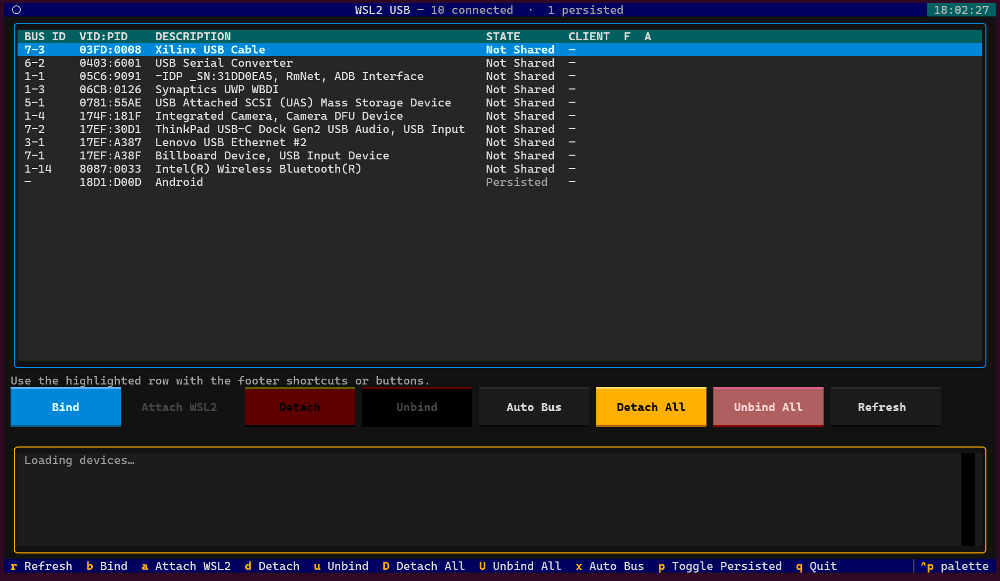

# WSL2 USB TUI

A terminal interface for sharing, attaching, and managing USB devices in WSL2
with [usbipd-win](https://github.com/dorssel/usbipd-win).



## Features

- View connected and persisted USB devices in one table
- See bus IDs, hardware IDs, device state, and attached clients
- Bind, attach, detach, and unbind individual devices
- Detach or unbind all devices at once
- Automatically attach selected bus IDs when they appear
- Refresh device state automatically
- Use buttons or keyboard shortcuts
- Handle administrator-only operations through a Windows UAC prompt

## Requirements

- Windows with [WSL2](https://learn.microsoft.com/windows/wsl/install)
- A Linux distribution running under WSL2
- [usbipd-win](https://github.com/dorssel/usbipd-win) installed on Windows
- Python 3.10 or newer in WSL

Install `usbipd-win` from PowerShell:

```powershell
winget install usbipd
```

Keep WSL and its kernel up to date:

```powershell
wsl --update
```

## Installation

Run these commands inside WSL:

```bash
git clone https://github.com/gabrieldurante/usbipd-tui.git
cd usbipd-tui

python3 -m venv .venv
source .venv/bin/activate
python3 -m pip install -r requirements.txt
```

## Usage

Start the application from WSL:

```bash
python3 wsl2_usb.py
```

Select a device with the arrow keys, then use a button or keyboard shortcut to
perform an action.

| Key | Action |
| --- | --- |
| `r` | Refresh devices |
| `b` | Bind the selected device |
| `a` | Attach the selected device to WSL2 |
| `d` | Detach the selected device |
| `u` | Unbind the selected device |
| `D` | Detach all devices |
| `U` | Unbind all devices |
| `x` | Toggle automatic attachment for the selected bus ID |
| `p` | Show or hide persisted devices |
| `q` | Quit |

Binding and unbinding require administrator privileges. The application opens a
Windows UAC prompt when either action needs elevation.

## Automatic attachment

Press `x` on a connected device to enable automatic attachment for its current
bus ID. The application will bind the device if necessary and attach it to WSL2
whenever it detects that bus ID.

Auto-attach selections are stored at:

```text
~/.config/wsl2_usb/auto_attach_busids.json
```

Because this feature tracks bus IDs, a device may need to be selected again if
Windows assigns it a different bus ID after it is moved to another USB port.

## Troubleshooting

- Make sure the USB device is connected to Windows and visible to `usbipd`.
- Run `usbipd list` in PowerShell to verify the Windows-side installation.
- Keep a WSL terminal open while attaching a device.
- Run `lsusb` in WSL to confirm that an attached device is available to Linux.
- If a device is attached but inaccessible to your user, configure an
  appropriate Linux `udev` rule for it.

For platform-specific help, see Microsoft's
[Connect USB devices under WSL](https://learn.microsoft.com/windows/wsl/connect-usb)
guide.

## Tests

Install the development dependencies and run the test suite from WSL:

```bash
python3 -m pip install -r requirements-dev.txt
python3 -m pytest
```

## License

This project is licensed under the [GNU General Public License v3.0](LICENSE).
